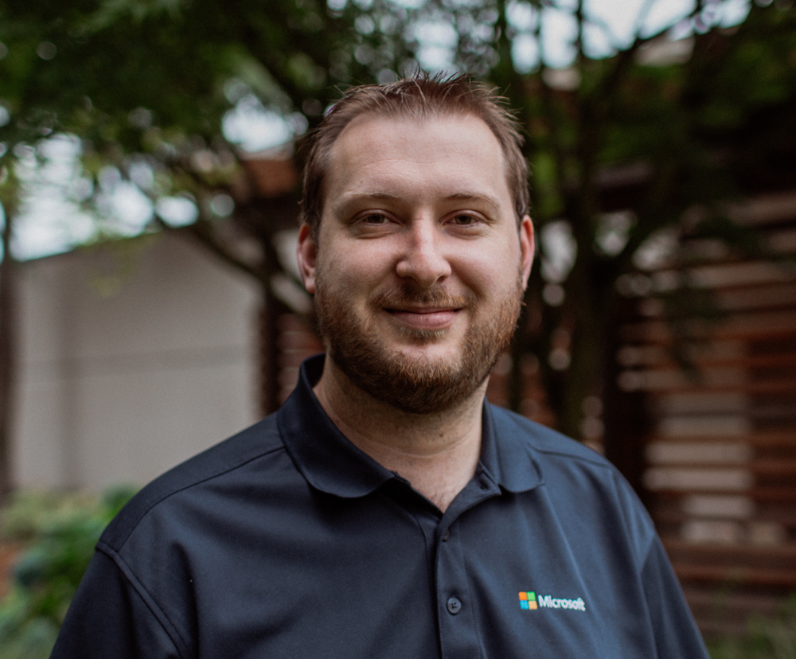
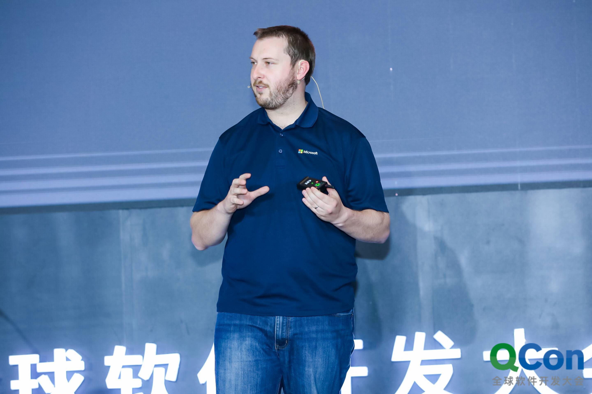
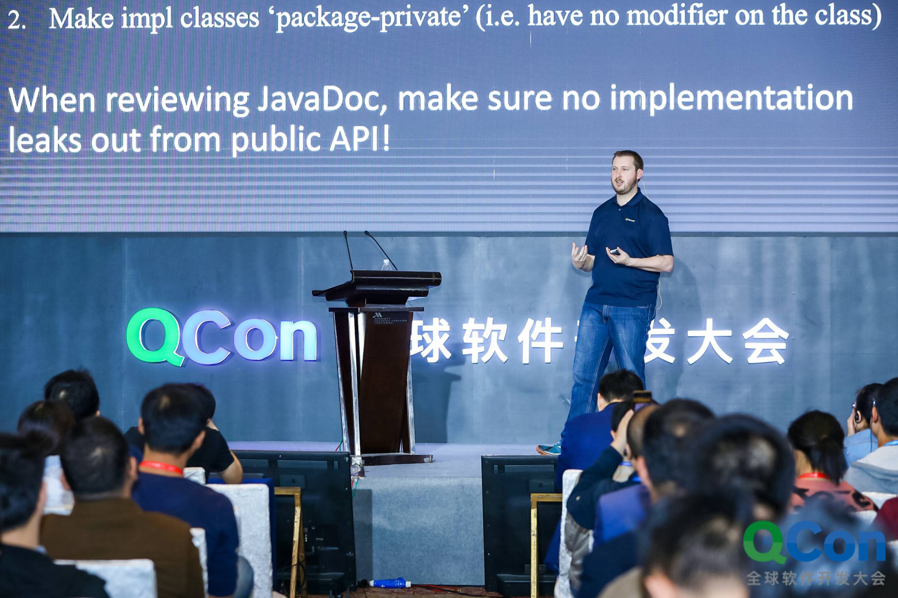
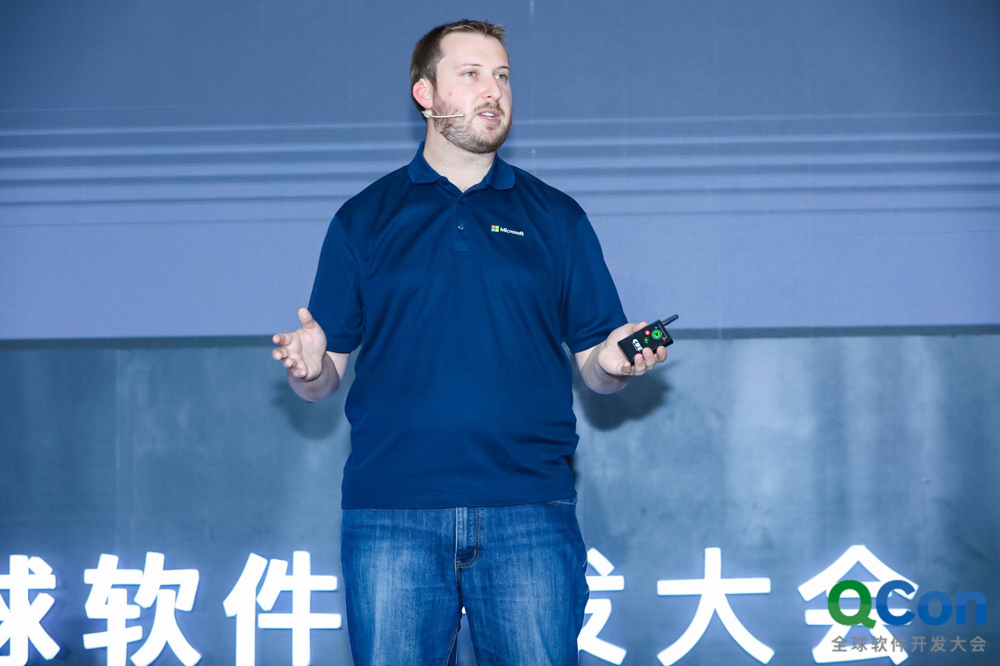
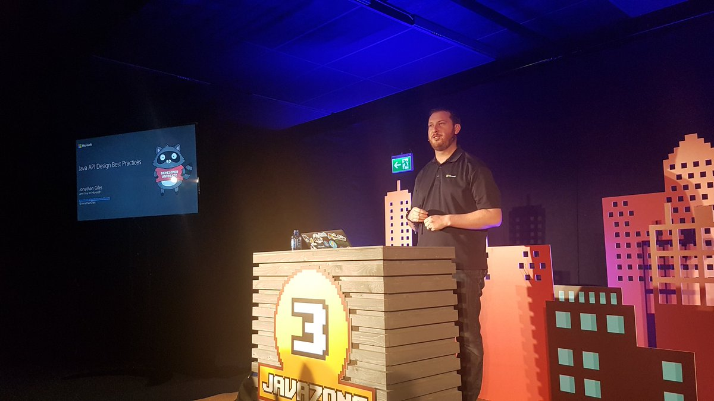

## Bio (Short)
Jonathan Giles is a principal software engineer and Java architect at Microsoft, where he is helping to build out the next generation of Azure client libraries.

## Bio (Long)
Jonathan Giles is a principal software engineer and Java architect at Microsoft, where he is helping to build out the next generation of Azure client libraries. Before this, Jonathan was a Java cloud developer advocate at Microsoft for one year, and a technical lead on the Java team at Sun Microsystems and Oracle for nine years, where he contributed to all Java releases between Java 7 and 10. He is passionate about creating excellent developer experiences with API, documentation, testing, and tooling, and as a result of his efforts in these areas he is a Java Champion, JavaOne Rockstar, and a Duke’s Choice award-winner.”

## Images

